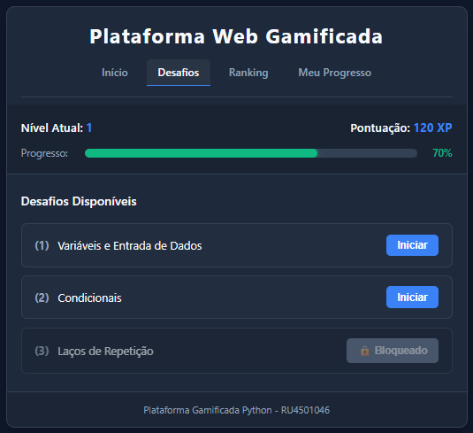
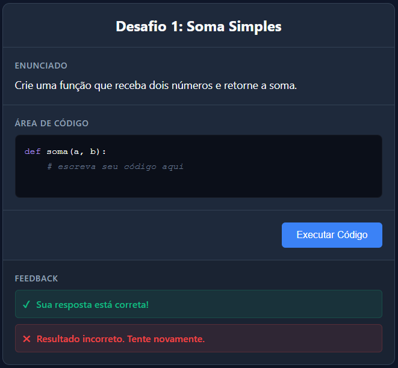
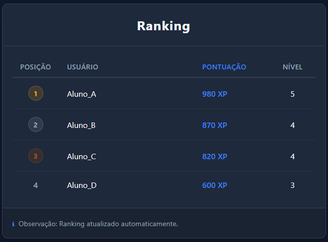

# Plataforma Web Gamificada para Ensino de Programação em Python

Este repositório contém o código-fonte e os artefatos do Trabalho de Conclusão de Curso (TCC) desenvolvido por **Marcelo Ferrari – RU 4501046**, cujo objetivo é criar uma **plataforma web gamificada** voltada ao ensino de programação em Python, com desafios progressivos, pontuação, ranking e feedback automático.

---

## 🎯 Objetivo do Projeto

Desenvolver uma plataforma web interativa que auxilie estudantes iniciantes e intermediários no aprendizado de programação em Python, utilizando elementos de gamificação para aumentar o engajamento, motivação e persistência.

A plataforma inclui:

- Desafios práticos de programação  
- Feedback automático das respostas  
- Sistema de pontuação e níveis  
- Ranking entre usuários  
- Interface web acessível e responsiva  

---

## 🧩 Tecnologias Utilizadas

### **Frontend (Web)**
- HTML5  
- CSS3  
- JavaScript  
- Mockups e protótipos de interface  

### **Backend**
- Python  
- Funções de validação automática  
- Lógica de pontuação e ranking  

### **Infraestrutura**
- GitHub (versionamento)  
- Estrutura modular (frontend + backend + mockups)  

---

## 🖼️ Prints da Plataforma (Mockups Web)

### **Tela Inicial**


### **Tela de Desafio**


### **Tela de Ranking**


> As imagens acima representam protótipos visuais da plataforma web gamificada.

---

## 📁 Estrutura do Projeto
```python
Plataforma-gamificada-python/
│
├── frontend/
│   ├── index.html
│   ├── desafios.html
│   ├── ranking.html
│   └── styles.css
│
├── backend/
│   ├── validacao.py
│   ├── pontuacao.py
│   └── desafios.py
│
├── mockups/
│   ├── tela_inicial.png
│   ├── tela_desafio.png
│   └── tela_ranking.png
│
└── README.md

```
---

## 🧪 Exemplos de Código

### Desafio em Python
```python
def soma_dois_numeros(a, b):
    return a + b

```

```python
# Validação Automática
def validar_resposta(funcao_estudante):
    try:
        resultado_teste = funcao_estudante(10, 15)
        return resultado_teste == 25
    except Exception:
        return False

```
# 🚀 Como Executar o Projeto
git clone https://github.com/MarceloferrariGit/Plataforma-gamificada-python

1. Clone o repositório
git clone https://github.com/MarceloferrariGit/Plataforma-gamificada-python

2. Acesse o diretório: cd Plataforma-gamificada-python
4. Execute scripts Python: python backend/validacao.py


👨‍💻 Autor
Marcelo Ferrari  
RU 4501046

📜 Licença
Este projeto utiliza a licença MIT, permitindo uso livre e aberto do código.
